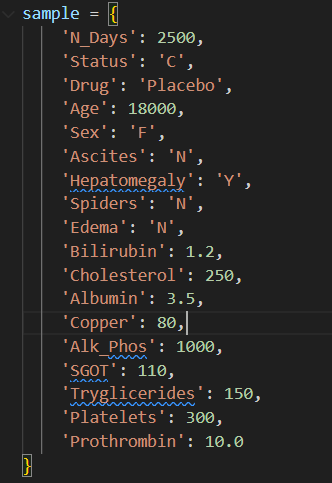

# 🧬 Liver Cirrhosis Stage Detection using Machine Learning

This project builds a machine learning model to detect the **stage of liver cirrhosis** based on clinical features of patients. The data is sourced from a Mayo Clinic study on primary biliary cirrhosis (PBC).

---

## 🎯 Objective

To predict the **histologic stage** of liver damage (Stage 1, 2, or 3) using patient medical data such as age, liver enzyme levels, bilirubin, cholesterol, and other categorical symptoms.

---

## 📁 Project Structure

liver_cirrhosis_stage_prediction/
│
├── liver_cirrhosis.csv # Dataset (Mayo Clinic)
├── model_training.py # Script to preprocess, train, and save the model
├── predict_stage.py # Script to load model and predict stage from new patient data
├── stage_predictor.pkl # Trained Random Forest model
├── label_encoders.pkl # Encoders for categorical variables
└── README.md # Project documentation


---

## 📊 Dataset Overview

- **Source:** Mayo Clinic study (1974–1984)
- **Rows:** ~25,000
- **Target:** `Stage` (histologic stage: 1, 2, or 3)

### 🔑 Features Used:

| Feature        | Description                                               |
|----------------|-----------------------------------------------------------|
| N_Days         | Days between registration and study event                 |
| Status         | C (Censored), CL (Liver transplant), D (Death)           |
| Drug           | D-penicillamine or Placebo                                |
| Age            | Age in days                                               |
| Sex            | M or F                                                    |
| Ascites        | Y or N (Presence of fluid accumulation)                   |
| Hepatomegaly   | Y or N (Enlarged liver)                                   |
| Spiders        | Y or N (Spider angiomas on skin)                          |
| Edema          | N, S, or Y (related to fluid swelling and diuretics)     |
| Bilirubin      | Blood bilirubin level (mg/dl)                             |
| Cholesterol    | Blood cholesterol level (mg/dl)                           |
| Albumin        | Blood albumin level (gm/dl)                               |
| Copper         | Urinary copper excretion (ug/day)                         |
| Alk_Phos       | Alkaline phosphatase level (U/liter)                      |
| SGOT           | Liver enzyme (U/ml)                                       |
| Tryglicerides  | Triglycerides (mg/dl)                                     |
| Platelets      | Platelets count (ml/1000)                                 |
| Prothrombin    | Prothrombin time (s)                                      |

---

## ⚙️ How to Run

### 1. Activate venv

```bash
venv\Scripts\activate

```
### 2. Install dependencies

```bash
pip install -r requirements.txt

```

### 3. Open the prediction.py
## Now in sample section, add any sample patients data in defined columns, for eg.:
  

### 4. Run the prediction.py

```bash
python prediction.py

```
---

Model Performance
Model Used: Random Forest Classifier

Test Accuracy: ~96%

Evaluation: Precision, Recall, F1-Score (for each stage)

---


